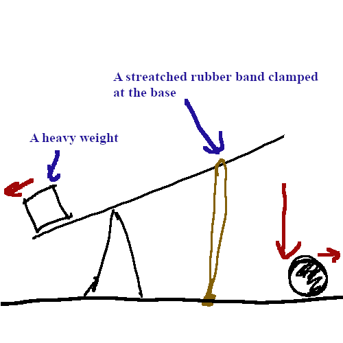
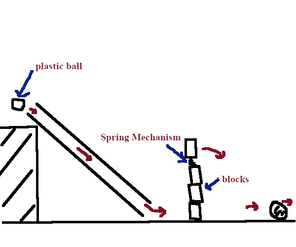
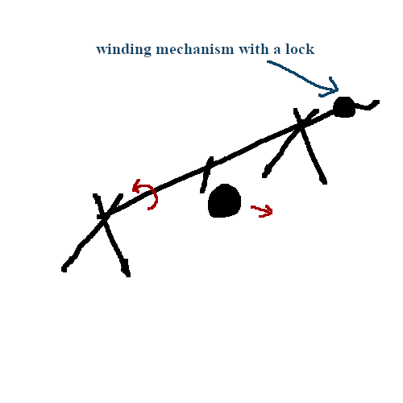
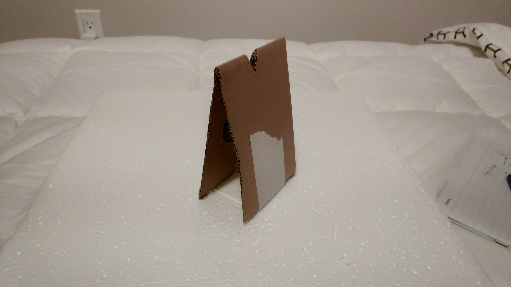
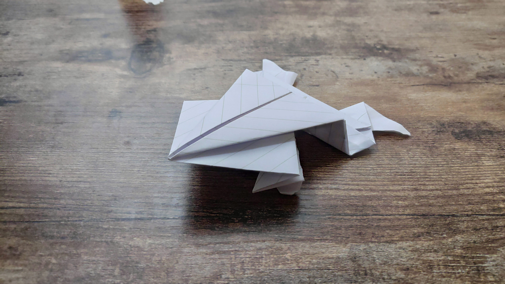
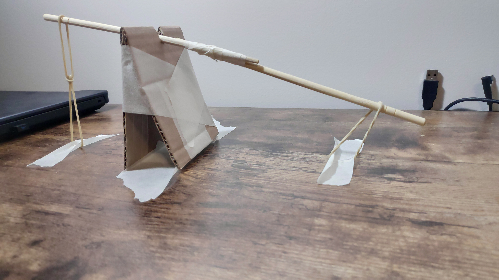
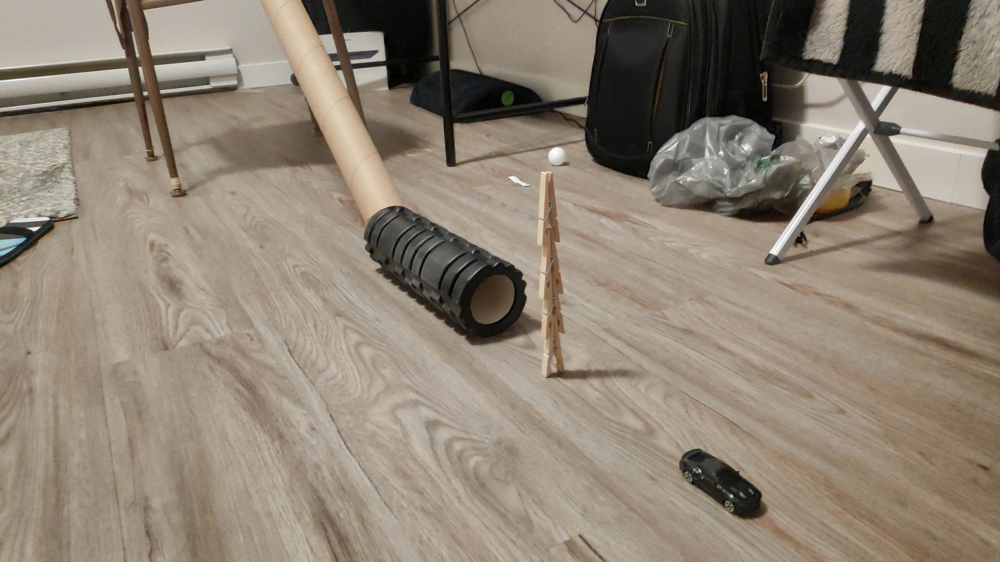
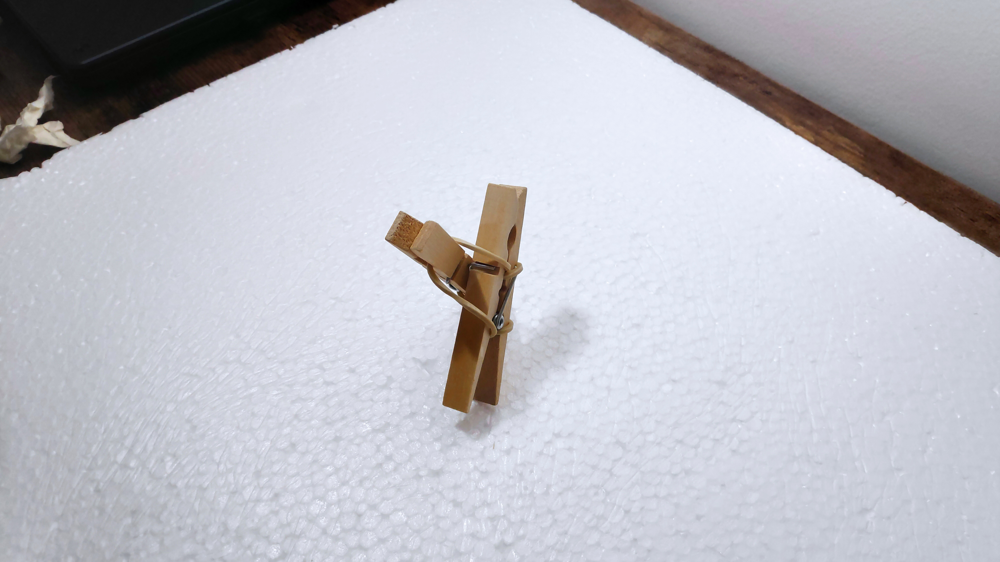
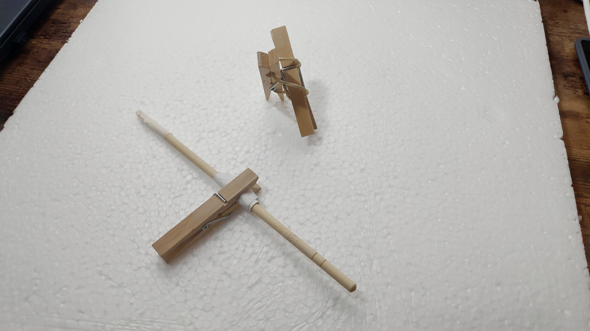

# Lab 01 - No-tech Puppeteering
27th January 2022

---
## Background
In this lab we were asked to design three low-tech solutions for move an object 1mm, 10mm and 100mm distances. The goal was to get familiarize with quick mulit-iteration  designing, sketching and documentation.

## Stage 1: Brainstorming
As the first step I started thinking of various items and types of actions and objects that I could use to design and make the sketches. Following are a list of items, actions and objects that I came up with by the end of the first step. 

- **Items**
  - cardboard tubes
  - cardboard boxes 
  - threads
  - rubber bands
  - glue
  - clay
  - rigid form 
  - tape
  - Sticks (e.g.: chopsticks)
  - cloathpins
- **Actions**
  - hot water/ steam
  - leavers/ balances
  - rubber bands/ stored power
  - gravity
- **Objects (for final motion)**
  - toys
  - hand-crafted paper objects (e.g.: origami)
  - rubber/ plastic balls

Some of the items I found by going through my apartment, some things I bought from a local hardware store (e.g.: tape, rubber bands, etc.) and some I was not able to obtain (e.g.:clay, glue, etc.).

## Stage 2: Designing
Depending on the Actions I came up with in the brainstorming session I planed on using three main concepts for my sketch designs 

### 1mm design
For this I designed a sketch of a lever with weights on one end and a stretched rubber band on the other end which will release the stored energy when the weight on the other end is dropped which in turn will provide a downward force that could be used to move an object

### 10mm design
For the 10mm sketch I designed a system with the main idea of gravity and stored power which will move the object at the end (*motion depicted in red colour*)

### 100mm design
The design for 100mm was mainly based on stored power of rubber bands. I thought of a mechanism that could be wound with rubber bands which will in turn rotate a stick held upon two stands. The rotational force is used by a peg fixed to the stick at the center to move the object

## Stage 3: Sketching
Depending on the lack of some items and due to the problems I faced when making the sketches from the designs I had to alter some parts of the designs

### 1mm Sketch
**Items used:** *chopsticks, cardboard, tape, a frog made out of paper and rubber bands*

I made the stick by joining two chopsticks with the rubber band and the was made by folding a cardboard piece and taping it. Since the stick could not hold a considerable weight I had to use two joined rubber bands to apply the force from the other end as well. I clamped the rubber bands using tape to the desk. Also since the resulting force from this was not enough to move a heavy object, so I chose the paper object (a frog made out of paper) for this sketch

Stand             | Frog        
:-------------------------:|:-------------------------:
  |  

*the completed sketch*

*video:*

<iframe src="https://drive.google.com/file/d/155-fb7xzWylFjYuPGtBbWjp-P-fZlWMh/preview" width="640" height="480" allow="autoplay"></iframe>

### 10mm Sketch
**Items used:** *cardboard tube, ping pong ball, toy car, clothespins, foam roller*

In this sketch I used clothespins connected together as the blocks and for the spring mechanism I partially connected the topmost clothespin so that it will spring when all are fallen. For the final object I used the toy car. Since the ping pong ball was not coming out at in the direction I wanted once it goes through the tube I had to use the foam roller to adjust the direction.

*The final setup:*

*videos:*

<iframe src="https://drive.google.com/file/d/1gzVBHHDR9ortMfWOR0JXPpTUMwjCrtw2/preview" width="640" height="480" allow="autoplay"></iframe>

<iframe src="https://drive.google.com/file/d/1fYN2ttXuRSzKCCEIK2FgN1oGgGLHe8lv/preview" width="640" height="480" allow="autoplay"></iframe>

### 100mm sketch
**Items used:** *cardboard stands, tape, rubber bands, clothespins, a chopstick, a massage ball*

In this sketch the main challenge was creating winding mechanism. After some tinkering  I manage to create a winding mechanism using two clothespins and a couple of rubber bands and for the moving object I managed to use a rubber massage ball.  

I used the same type of stands which I had used in my 1mm sketch here to hold the chopstick which I used as the rotating mechanism. 

*final result:*

<iframe src="https://drive.google.com/file/d/19FxpyL-SapGRaYcGOwFM1NvAY83MHfs9/preview" width="640" height="480" allow="autoplay"></iframe>