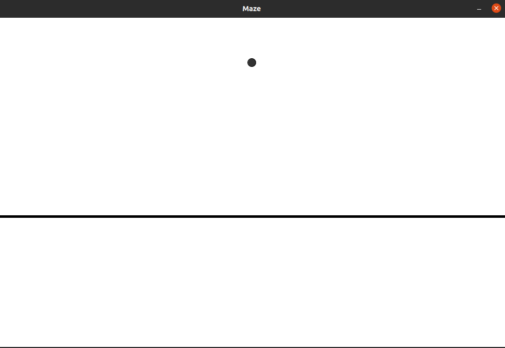
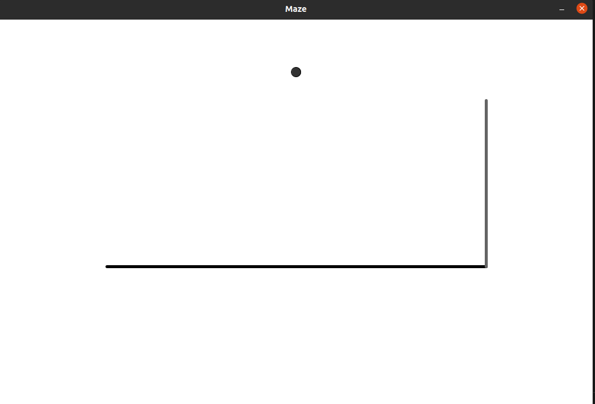
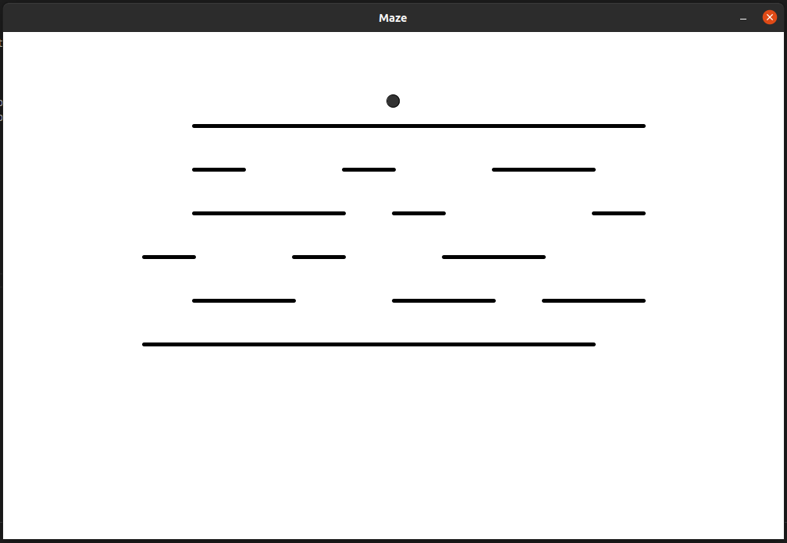
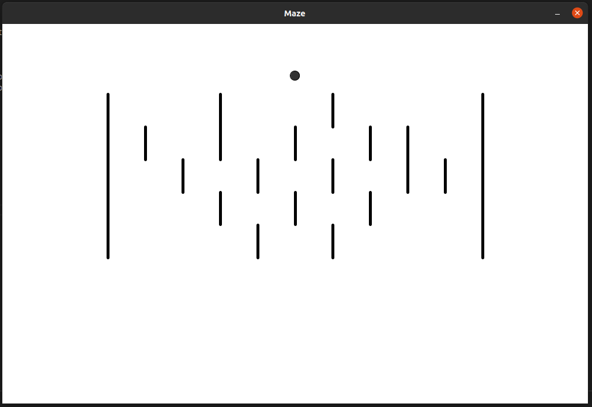
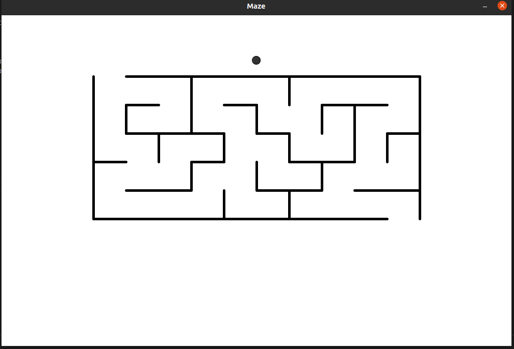

# Lab 02 - Hello Maze with Haply
3rd February 2022

---

We were introduced to the Haply and developing force-feedback based applications with it's API (hAPI). The task was to set up the development environment in our personal computers and first run the "Hello Wall" example code given to test and familiarize ourselves with the coding for the Haply. Once it's done, we were asked to create a maze that can be navigable with the Haply by using the Hello Wall example. 

## Haply initial Set up and Hello Wall
Even though according to the steps mentioned on the website and the instructions given to us thorough the slides setting up the haply was supposed to be very easy. But since because of the lack of experience with the device and due to the insufficient information about installation guidelines and resolving frequent errors (even the GitLab repository didn't contain any error information), it took several days to resolve an issue related to tracking the motion of the haply end-effector (it was
detecting the movement on one direction only and turns out it was an error with the encoder package in Arduino). After resolving that, the Haply was working correctly and the Hello Wall code is producing correct feedback. 

## Hello Maze
Before starting on setting up the maze with feedback I first started going through the code in order to set up the UI for the Maze visualization. For this my first approach was to remove some excess GUI elements form the Hello Wall code. These elements were namely the start joints and the arms. Then I also reduced the size of the end effector visualization so that it will be easier to navigate within a maze.

||
|*figure 1*|

Next I trimmed the first wall to be bounded within the window and tried creating another wall and getting haptic feedback working with both the walls. for the new wall I decided to go for a vertical wall instead of another horizontal wall So I can also find the differences between providing feedback related to the orientation. Following is the code for the two walls. 

```java
PVector posWall = new PVector(0.02, 0.10);    // previous Wall
PVector posWall2 = new PVector(0.08, 0.10);   // the new wall

wall = create_wall( posWall.x - 0.1, posWall.y+radiusEE, posWall.x+0.06, posWall.y+radiusEE);
wall.setStroke(color(0));
wall2 = create_wall(posWall2.x, posWall2.y+radiusEE, posWall2.x, radiusEE + 0.03 );
wall2.setStroke(color(100));
```
The following figure shows two wall design,

||
|*figure 2*|

While trying this I realized for a particular wall there were three main Vectors used in order to provide visualizing with force-feedback (One for Graphics, one for force calculation and one for passing the force information back to the Haply). 

Then I started the maze implementation. For this I used an existing maze found online online 

| |
| *figure 3: (source: [wikipedia](https://upload.wikimedia.org/wikipedia/commons/8/88/Maze_simple.svg))*

First I created the Graphics of the maze. For this I hardcoded all the coordinates in two arrays (starting position and length of the walls) and used a separate wall class for storing the necessary information for each wall. I divided the maze into two parts as horizontal and vertical walls in order to simplify the graphics creation and the sequent haptic implementations. The following sections show the codes and the graphics of the wall creation. 

```java
// Class for Wall creation
class Wall{
    PVector startPos;
    float wlength;
    PShape wallShape;

    public Wall(PVector sp, PShape ws, float len){
        startPos = sp;
        wallShape = ws;
        wlength = len;
    }
}


    // Initialize Walls (in setup())
verticalMWalls = new ArrayList();
horizontalMWalls = new ArrayList();


/* create wall graphics */
for(int i = 0; i< verticalW.length; i++){
    verticalMWalls.add(new Wall(new PVector(verticalW[i][0], verticalW[i][1]), create_wall(verticalW[i][0], verticalW[i][1], verticalW[i][0], verticalW[i][1] + verticalW[i][2]),  verticalW[i][2]));
}
for(int i = 0; i< horizontalW.length; i++){
    horizontalMWalls.add(new Wall(new PVector(horizontalW[i][0], horizontalW[i][1]), create_wall(horizontalW[i][0], horizontalW[i][1], horizontalW[i][0] + horizontalW[i][2] , horizontalW[i][1] ),  horizontalW[i][2]));
}

// Drawing the walls (in draw() )
for(Wall vWall: verticalMWalls){
    shape(vWall.wallShape);
}
for(Wall hWall: horizontalMWalls){
    shape(hWall.wallShape);
}

```
Here's the created maze

|||

 

 Finally, I set up the code for the haptic feedback as follows;

```java

float tempX = posEE.x;
float tempY = posEE.y;

for(Wall hWall: horizontalMWalls){
if(Math.abs(tempY - hWall.startPos.y) <= radiusEE){
    if(hWall.startPos.x <= tempX && hWall.startPos.x + hWall.wlength > tempX ){
        penWall.set(0,(hWall.startPos.y - (tempY + radiusEE)));
        if(tempY > hWall.startPos.y){
        forceWall = forceWall.add(penWall.mult(kWall));
        }else{
        forceWall = forceWall.add(penWall.mult(-kWall));
        }
        
    }
}
}

for(Wall vWall: verticalMWalls){
    if(Math.abs(tempX - vWall.startPos.x) <= radiusEE){
        if(vWall.startPos.y <= tempY && vWall.startPos.y + vWall.wlength > tempY ){
            penWall.set((vWall.startPos.x - (tempX + radiusEE)), 0);
            if(tempX > vWall.startPos.x){
            forceWall = forceWall.add(penWall.mult(kWall));
            }else {
            forceWall = forceWall.add(penWall.mult(-kWall));
            }
        }
    }
}
```

The video of the working application with haply is as depicted below,

<iframe src="https://drive.google.com/file/d/1-BGe4MdPkuOEVT65-it6aqY6LHzkMdnZ/preview" width="640" height="480" allow="autoplay"></iframe>

One issue I faced with the feedback is that the feedback given in both negative directions was more closer to a vibration rather than a force. I tried to debug the issue for couple of hours but was not able to find the root of the problem.

The full code could be found [here](https://github.com/canuradha/CanHap2022-PersonalBlog/tree/haply_maze)