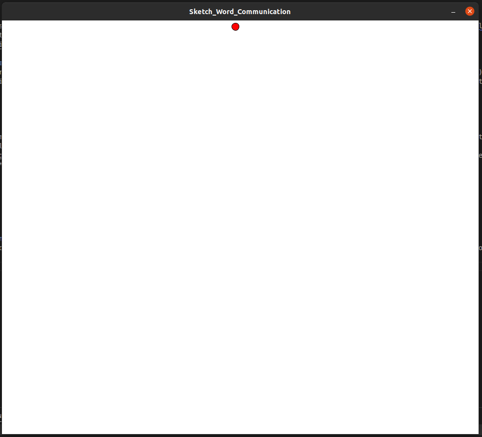
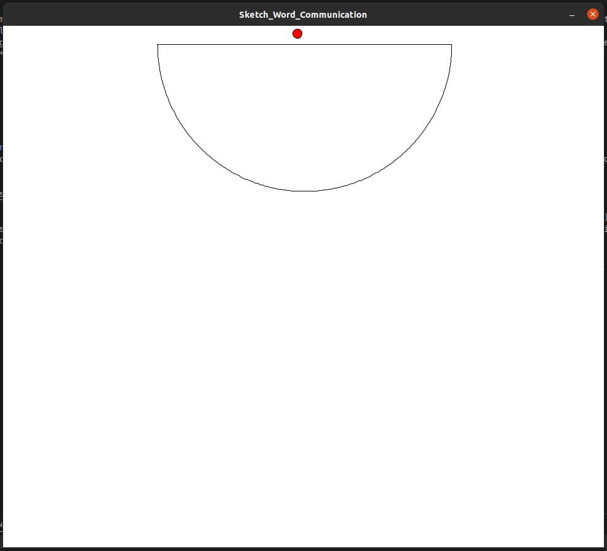
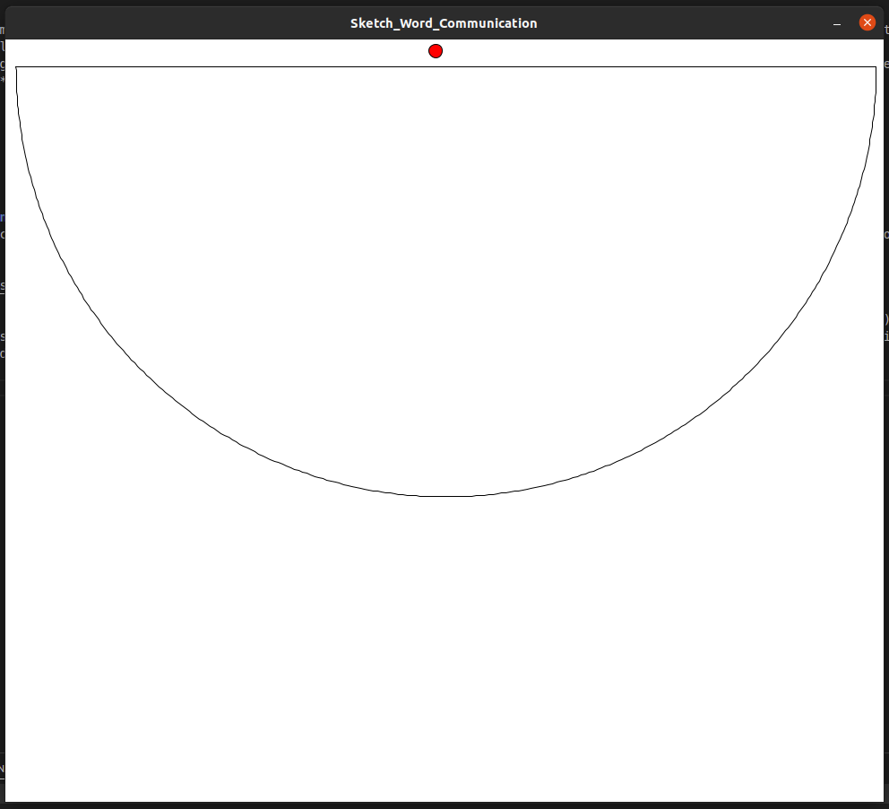
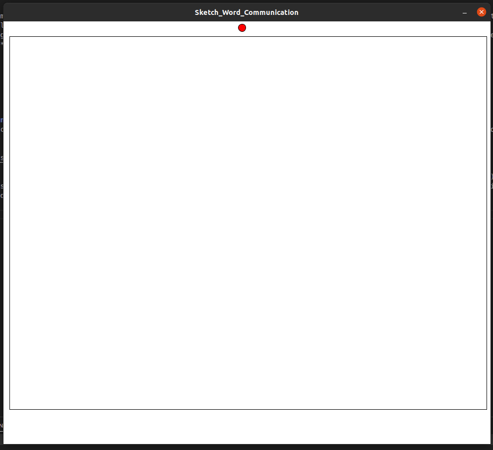
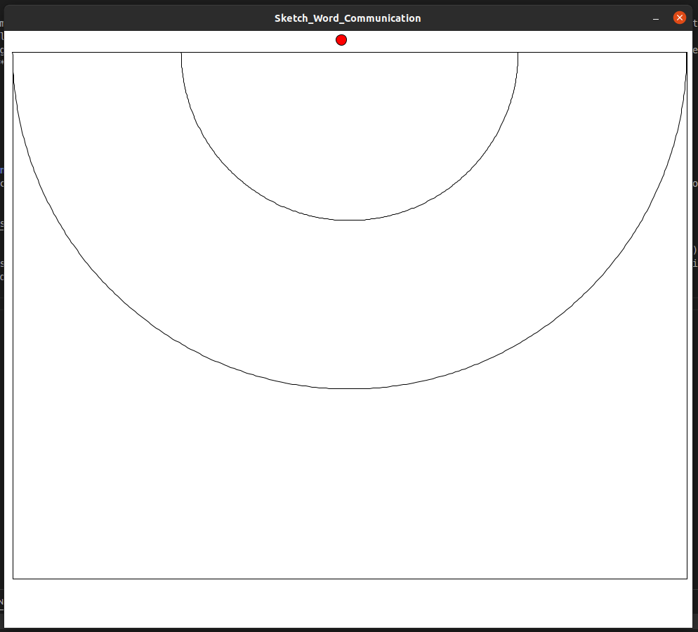
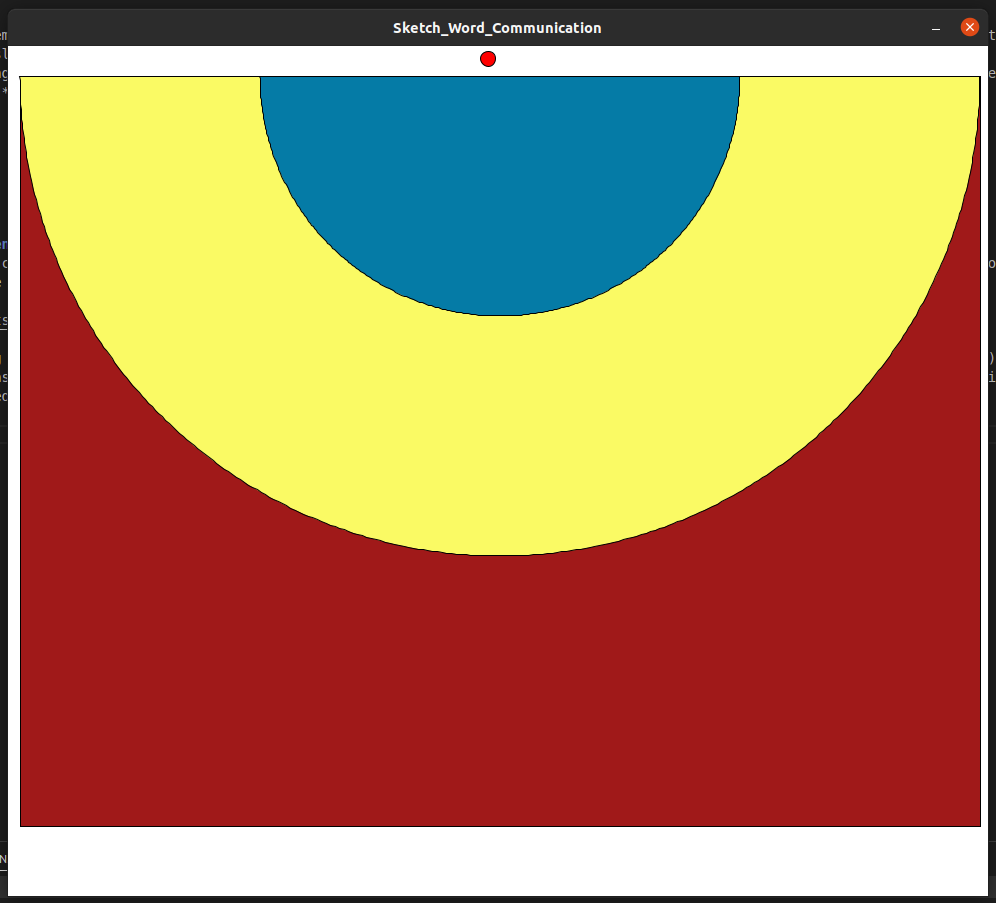

# Lab 3 - Communicating Emotions
10th Feb 2022

---
In the third Lab sessions we were asked to build a haptics app to communicate three words through the Haply. Since I had only used the only the *hAPI* library and I was interested in understanding the differences between the it and the *Haply Fisica* library I decided to use one of Haply [Fisica examples](https://2diy.haply.co/) as the base of my application. 

## Choosing the three words
When choosing the three terms I thought of communicating emotions will be the best way to go because it (showing emotions through haptics) was a thing I wanted to try ever since I heard about it in the class. So in order to keep them highly distinguishable I chose to go with the following three words;

- Calm
- Scared
- Angry

My plan was to implement three types of guided motions with dampening to convey the chosen words. *Calm* was to be implemented with a little slower/ dampened movement (slower than normal) of the end effector, *Scared* as a slick movement (fast motion) and *Angry* as a quick vibrational movement. but upon further thinking I realized the motion I'm envisioning for the *Scared* emotion can be more correctly described as *Skittish*. So I ended up using that instead of the *Scared* emotion. Hence, my
final words were;

- Clam
- Skittish
- Angry

## Sketching
### Setting up the environment
As the first step I cleaned the example code I found for Fisca Maze to contain only the end effector visualization and increased the window and canvas size to showcase the full range of the Haply. 



Since I was planning to have three different sections for conveying the three emotions I created thee objects (two semi-circles and a box) to cover most of the window/ canvas area in three different colors. The colors were added just to identify the emotions for myself while implementing since we were specifically required to not use any visual or audio feedback in this Lab and the following test with at least one other person.  

|  |  |
|  |  |



### Integrating Emotions
After going through the code I realized that detecting object interactions using the *Haply Fisca* library is easier compared to using just the
*hAPI*. you just have to call a method (*isTouchingBody()*) for the sensor object to determine if it's in contact with the other objects. I also
realized that setting up forces for the end effector is also very straight forward with the *Haply Fisca* and I understood one of the issues I had in
the Lab 2 was due to the repeated direction change of the force from the run method. 

Once I understood how the force generation from the code it was easy to created the feedback for each objects in the way I wanted. Here's the code for
setting up the three types of feedback (dampened motion, slick motion and vibrational motion) for the three words.

```java
    virtualCouplingX = sensor.getVirtualCouplingForceX();
    virtualCouplingY = sensor.getVirtualCouplingForceY();   

    // ---------------Setting up the Vocabulary throught the created objects--------------

    if(sensor.h_avatar.isTouchingBody(firstBoundary)){
      dampingForce = 900;
      virtualCouplingX = -virtualCouplingX;
      dampingScale = 100000;

    }else if(!sensor.h_avatar.isTouchingBody(firstBoundary) && sensor.h_avatar.isTouchingBody(secondBoundary)){
      dampingForce = 900;
      dampingScale = 10000;
    }else if(!sensor.h_avatar.isTouchingBody(secondBoundary) && sensor.h_avatar.isTouchingBody(thirdBoundary)){
      dampingForce = 250;
      virtualCouplingX = -virtualCouplingX;
      virtualCouplingY = -virtualCouplingY;
    }else{
      dampingForce = 0;
      dampingScale = 100000;
    }

    // ------------------ End set-up --------------------------------------------------

    sensor.h_avatar.setDamping(dampingForce);
    fEE.set(virtualCouplingX, virtualCouplingY);
    fEE.div(dampingScale);                        // to reduce the force on the end effector

    torques.set(widgetOne.set_device_torques(fEE.array()));
    widgetOne.device_write_torques();

```
Here's a video of the application working with Haply:

// video

## Evaluation of the sketch with a person
For the evaluation I asked my roommate to test it and express what kind of word he could use to describe the motions in different sections. For this
test I didn't show him the UI window and just asked him to play with the haply and say what he thinks of the motions. He identified the ***Calm*** section
(smaller blue semi-circle) correctly but for the two other sections he described them as ***passionate*** (for the ***skittish*** section - larger
yellow semi-circle) and ***aggressive*** (for ***angry*** section - red square). Even though I implemented the two latter motions with ***Skittish***
and ***Angry*** in mind I realized that his interpretations were also very much similar when conveyed through the haply. 

The complete code for the sketch can be found [here]()