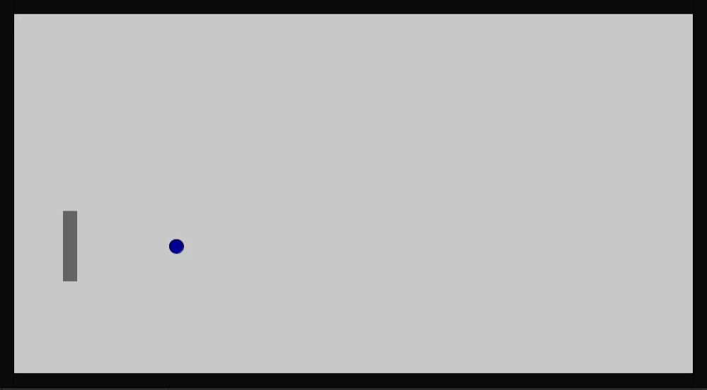
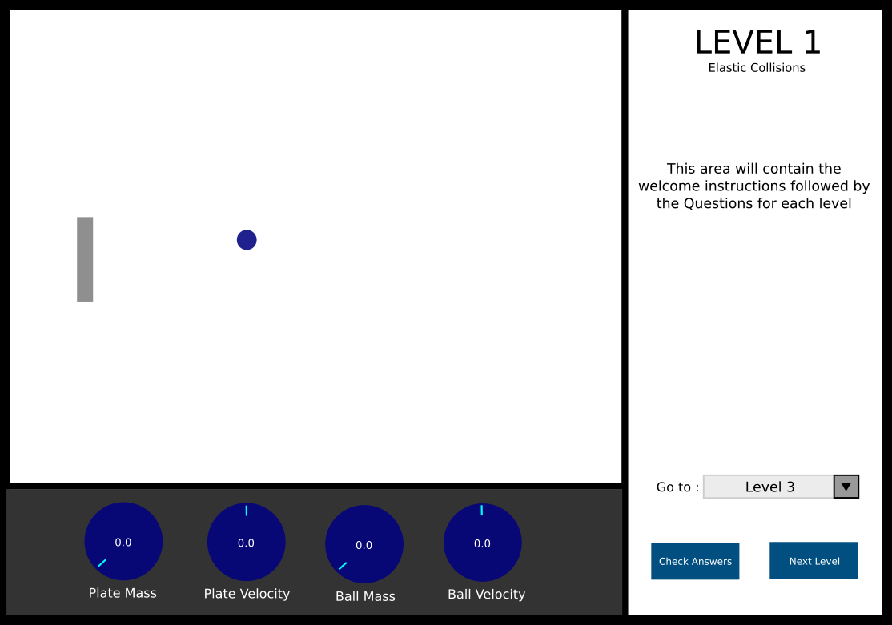

# Back to High School: <br/> Haplastic Collisions Project (Iteration 1)
6th Mar 2022

---

Learning about a concept and understanding its suitable applications is not an easy task.
Learning about basic motion concepts in Physics, which are one of the main pillars supporting complex theories in physics
as well as in any other area which involves motion (that is, pretty much everything !), is very 
crucial for anyone who is planning to work in a related field. That is why as our course project, 
Kevin, Melissa and I, decided to try and incorporate haptics to augment the learning experience of
motion mechanics in physics education. Our idea was to enhance the learning experience with the Haply and a game of pong.

As our first iteration, we decided to explore the possibility of describing collisions (both elastic 
and inelastic) as well the effect of gravity on an object, using haptics with a virtual environment. 
While Melissa was conducting a literature review on usage of feedback for physical education (in addition to playing with gravitational forces using Haply) and Kevin
working on figuring out the Haptics behind collisions, I mainly focused on creating an intuitive user
 interface for conveying the motion mechanics and the main physics theories (in this iteration,
 collisions) behind the said motions. The blogs on their respective work can be found below;

 - [Melissa's Blog on Iteration 1]()
 - [Kevin's Blog on iteration 1]()

## The Initial Discussion

After agreeing to work on different aspects of the project for our first iteration as mentioned above, 
we had a discussion/ brainstorming session about each of our planned work. As for the UI, our plans 
were to build an interface where users see a live change in important variables (e.g.: mass of the
object, velocity, total amount of attractions from other objects, .etc) and have a level based 
progression with multiple views/ interfaces (i.e.: welcome view, instructions view, game level 1, etc.)

## UI Version 1.0

So as for initial iteration I focused on creating the main view or the level view where most of the 
feedback based interactions are going to occur. Since our main idea is to use a pong game as the game 
of choice for incorporating motion mechanics, I First created a basic UI which consists of a ball and 
a rectangular paddle (used by the user to control the motion of the ball). An image of the view is depicted below.



Then I added user movement to the paddle using the Keyboard. The main reason for using the keyboard 
first instead of directly using the haply was to minimize the possible setbacks from feedback errors 
due to Haply, and since Kevin was mainly working on the haptics behind collisions in this iteration, I
could directly incorporate his code to the UI at a later stage. Since this needs to be a continuous 
motion (in contrast to it being a step-wise motion where paddle moves only one step for a key press),
I used changed the horizontal and vertical components of the velocity (did I mention that I am using 
the [fisica](https://gitlab.com/Haply/hapi-fisica/-/releases/V03) library for haply !) in order to
alter the motion. Here's the code for setting up the paddle motion using the keyboard.

```java
class SimulationThread implements Runnable{
  public void run(){
      /*Additional code */
      basePlate.setVelocity(plateVelocityX, plateVelocityY);
  }
}

// Listen for Key presses
void keyPressed(){
  if(key == CODED){
    if(keyCode == UP){
      plateVelocityY -= 50;
    }else if(keyCode == DOWN){
      plateVelocityY += 50;
    }else if(keyCode == LEFT){
      plateVelocityX -= 50;
    }else if(keyCode == RIGHT){
      plateVelocityX += 50;
    }
  }
}
```
## Adding Motion

Next I started adding the collision mechanics for implementing the interactions of the plate with the
ball. After going through the theory behind elastic collisions (which, brought back ghosts from the 
past !!) I implemented the theory of conservation of momentum in a way that with every collision the 
velocity of the plate reduces with a constant factor thus will reduce it's momentum and changes the 
momentum of the ball (for the initial instance where ball is stationary I gave it a starting velocity 
instead of using the momentum equation in order to improve the user experience with following 
collisions). Here's a video of the collisions at work (the paddle is controlled using the arrow keys
 of the keyboard)

 <iframe src="https://drive.google.com/file/d/1qd3GQVLCj1xzgwXcEJxTMR0Imbr5iARZ/preview" width="640" height="480" allow="autoplay"></iframe>

## UI Version 1.1

Following that I added the several controllers (using [ControlP5](https://sojamo.de/libraries/controlP5/) library) to
showcase the change of velocity of both the paddle and the ball as well as to adjust the mass both the 
ball and the paddle. Every time the mass was changed, the density of the objects were recalculated and 
incorporated into the motions. The size of the plate and the ball was changed as the fraction of the 
changing value since directly adding the changing value seems to have an unnecessarily large impact on
the size of the objects. Here's a video showcasing the final UI of this iteration in action. (motion 
of the paddle and size changes are handled by the keyboard). One important thing that needs to be
mentioned is that for the velocity visualizations only the magnitude of the velocity (i.e: speed)
is described. (I am planning on adding the direction in the next iteration)

<iframe src="https://drive.google.com/file/d/1BrExJJnDnW09aQ3tIVteN0u-Dyw4LZgb/preview" width="640" height="480" allow="autoplay"></iframe>

## Incorporating Haply with the UI

At this point I planned on integrating haply to the UI and it seems that the decision I made to 
implement the paddle movements with the keyboard was a good one. While trying to 
incorporate the Haply into the created UI, I realized that the Fisica library only provides a circular
shape as the shape of the end effector of the haply (mainly the shape for *HVirtualCoupling* object is 
a circle and it cannot be changed directly using the library). The only alternatives are to create a 
custom class extending the functionality of the Fisica Library (didn't manage to search much about 
this in this iteration) which will provide the ability to use custom shapes for the end effector, 
change the shape of the paddle to reflect the shape of the end effector (make it circular) or 
superimpose the location of the end effector shape below the shape of the paddle (this might not work 
since the collision positions for the rectangular paddle will be different from the collision 
positions of the circular end effector). Since this needs further discussions with the team I decided 
to push it to the next iteration.

## Switching Between Views

Even though in our initial discussion we planned on making multiple views and switching between them, I
was unable to find any possible view switching methods/ libraries for Processing (IDE) based 
applications. So after discussing with the team we decided on a single view based UI with dynamic 
components (i.e: changes will be handled by hiding/ showing components). A mock-up of the planned UI
is described below.



## Plans for the Next Iteration

In addition to the UI changes mentioned in the last section, we realized the best way to make the 
learning experience more immersive and educational was to incorporate a questionnaire about the motion
mechanics depicted in each level. We then can use the marks of the answers as a means to progress 
between levels. Other than that the following steps are planned for our next iteration
 - Combine what we had accomplished separately (i.e.: UI, collision haptics and gravitational Haptics) into one application
 - Improve the Force feedback and add visual factors like images (e.g.: for gravity wells) and colors and sound (e.g.: inelastic collisions) in order to improve the immersive experience.
 - Determine a set of questions for the questionnaire 
 - Determine main concepts that are to be emphasized in each level of the game. 

The full code for the iteration 1 can be found [here]() 