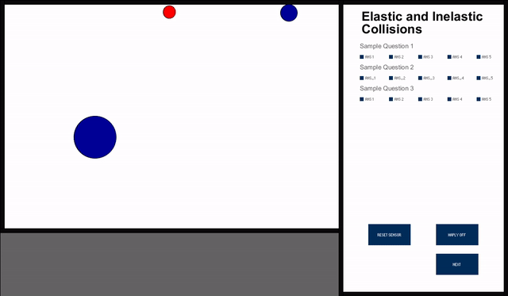

# Building the System: <br/> Haplastic Collisions Project (Iteration 2)
25th Mar 2022

---
As our second iteration in exploring haptics for gaining a better understanding of basic 
theories in physics, our objectives were to improve on our initial design framework and fine tune the haptic feedback 
on each of the learning concepts. More specifically the objectives could be stated as follows. 

 - Combine our individual work into one codebase to work on moving forward.
 - Improve the Force feedback on collisions and gravity based simulations and add visual factors like scale and color
   change for enhance the user experiance
 - Determine a set of questions for the questionnaire 
 - Determine main concepts that are to be emphasized in each level of the game. 
 - Improve the UI to what we planned at the end of [iteration 1]({{site.baseurl}}/Project_iter_1/)

## Ready, Steady, Start !!

For our first task we got together and decided on a set of finalized UI views to showcase the progressive nature
of our physical concept learning experience by combining our work into one system. After some rough sketches we agreed
upon a set of views that the user could use in order to learn about the concepts in a progressive manner with some
questionnaires in some views in order to check the users understanding of each concept. 

We planned on starting with a welcome page where we briefly explain the usage of the system and what they could learn
using the system followed by the concepts of collision (1 view each for elastic and inelastic collisions) where the
concept will be briefly explained and the user will have the opportunity to experience the nature of the collision by
using the haply (a similar view will be there for gravity). Some detailed Figures that we
created using [google Jamboard](https://workspace.google.com/products/jamboard/) are depicted below.

| |

|*welcome page*|

<br/>

|  |  |

|*Collisions Learning*|

<br/>

Once the user has a reasonable understanding about the two types of collisions the user will be
required to answer a few multiple choice questions related to a new sandbox where both elastic and inelastic collisions
are occurring (with feedback of the haply) in order to progress further within the system. 

| |

|*collision questionnaire*|

Until the user answers all the questions in a correct manner, they won't be able to progress onto the next concept. The
set of sketches for gravity is as follows.

| |

|*gravity Learning*|

<br/>

| |

|*Gravity Questionnaire*|

Finally, there will be a last view where both collision types and gravity based interactions are present and the user
needs to move through a gamified maze-like scenario in order to reach the target by using the knowledge of the learned concepts
(e.g.: an instance where the user can only pass without getting sucked into a gravity well is by colliding with a bigger
another object and breaking off some small part of the sensor object (decreasing the mass of the object using inelastic
collision))

| |

|*Gamified View with both concepts present*|

## Work Breakdown
While Melissa and Kevin were working on Improving the feel of Gravity and collisions respectively with the haply in
addition to improving the UI cues for interactions, I mainly worked on building the UI version 2 combining our work into
one codebase. You can find Melissa and Kevin's more detailed blog posts on their work linked below, 
 - [Melissa's Blog on Iteration 2](https://melissyu.wordpress.com/2022/03/25/project-iteration-2-haplastic-colliders/)
 - [Kevin's Blog on iteration 2](https://canhapticsstudentblogkeving.wordpress.com/project-iteration-2/)

## Setting up the UI
As the first step for this iteration, I started on the creating the version 2 of the main UI (the UI for working with
the haply). While working on it, I realized that the libraries that we are using doesn't support for multiple view
creation (within the same window) and I have to create all the components in one view and show a filtered out set of
components depending on the view the user is currently on. Since this will clutter our main file which includes various
force calculations as well, I decided to separate the UI elements into another java file ([*GUI.java*](https://github.com/canuradha/HaplasticCollider/blob/anuradha_iter_2/GUI.java)) by separately importing the
necessary libraries (both the Haply Fisica and ControlP5 libraries). Then I started creating/ initializing all the UI
elements using mainly two methods, one for object elements (i.e.: Fisica objects) and one for control elements (i.e.:
ContorlP5 elements) the two methods are described below,

```java
 public void initControls(){
        titleFont = currentApp.createFont("Arial Bold",50f);
        contentFont = currentApp.createFont("Arial", 20f);
        LevelTitleFont = currentApp.createFont("Arial Bold", 30f);
        questionsFont = currentApp.createFont("Arial", 15f);

        plateVelocity = ui.addKnob("Plate Speed")
                            .setRange(0,500)
                            .setValue(0)
                            .setPosition(100, 570)
                            .setRadius(50)
                            .setDragDirection(Knob.VERTICAL)
                            .hide();
  
        plateM =  ui.addKnob("Plate Mass")
                            .setRange(1,10)
                            .setValue(0)
                            .setPosition(260, 570)
                            .setRadius(50)
                            .setDragDirection(Knob.VERTICAL)
                            .hide();

        ballVelocity =  ui.addKnob("ball Speed")
                            .setRange(0,500)
                            .setValue(0)
                            .setPosition(420, 570)
                            .setRadius(50)
                            .setDragDirection(Knob.VERTICAL)
                            .hide();
        
        ballM =  ui.addKnob("Ball Mass")
                            .setRange(1,10)
                            .setValue(0)
                            .setPosition(580, 570)
                            .setRadius(50)
                            .setDragDirection(Knob.VERTICAL)
                            .hide();   
                            
        Impact_Slider = ui.addSlider("Impact Force Slider")
                             .setPosition(700,40)
                             .setSize(30,150)
                             .setRange(0,100)
                             .setValue(0)
                             .setColorValue(0x00000050)
                             .hide(); 
                             
        SliderLabel = ui.addTextlabel("Impact Force (%)")
                    .setText("Impact Force (%)")
                    .setPosition(630,205)
                     .setFont(contentFont)
                    .setColorValue(0x00000050)
                    .hide()
                    ;  

        startButton = ui.addButton("Start")
                            .setValue(0)
                            .setPosition( 1030, 600)
                            .setSize(100,50)
                            .onRelease(nextCallback);

        toggleHaptics = ui.addButton("tHaply")
                            .setPosition( 1030, 530)
                            .setSize(100,50)
                            .setSwitch(true)
                            .setLabel("Haply OFF")
                            .onRelease(toggleHapticsCallback)
                            .hide();

        resetSensor = ui.addButton("rSensor")
                            .setPosition( 870, 530)
                            .setSize(100,50)
                            .setLabel("Reset Sensor")
                            .onRelease(resetCallback)
                            .hide();                         

        ui.addListener(radioListener);

        menuTitle =  ui.addTextlabel("LevelTitle")
                        .setText("")
                        .setSize(300, 50)
                        .setPosition(850, 20)
                        .setFont(LevelTitleFont)
                        .setColorValue(0x00000000)
                        .hide();

        menuDesc =  ui.addTextlabel("LevelDesc")
                        .setMultiline(true)
                        .setText("")
                        .setSize(350, 100)
                        .setPosition(850, 100)
                        .setFont(questionsFont)
                        .setColorValue(0x00000060)
                        .hide();

    }

    public void initWorldBoundary(){
        world = new FWorld();

        topBoundary = new FBox(WORLD_WIDTH + 80, BOUNDARY_SIZE);
        topBoundary.setPosition(WORLD_WIDTH/2, BOUNDARY_SIZE/2);
        topBoundary.setFill(10);
        topBoundary.setStaticBody(true);
        topBoundary.setName("Boundary Top");
        
        rightBoundary = new FBox(BOUNDARY_SIZE, WORLD_HEIGHT);
        rightBoundary.setPosition((WORLD_WIDTH + 160 - BOUNDARY_SIZE)/ 2, WORLD_HEIGHT/2);
        rightBoundary.setFill(10);
        rightBoundary.setStaticBody(true);

        leftBoundary = new FBox(BOUNDARY_SIZE, WORLD_HEIGHT);
        leftBoundary.setPosition(BOUNDARY_SIZE/2, WORLD_HEIGHT/2);
        leftBoundary.setFill(10);
        leftBoundary.setStaticBody(true);
        leftBoundary.setName("Boundary Left");

        bottomBoundary = new FBox(WORLD_WIDTH + 80, BOUNDARY_SIZE);
        bottomBoundary.setPosition(WORLD_WIDTH/2, WORLD_HEIGHT - BOUNDARY_SIZE/2);
        bottomBoundary.setFill(10);
        bottomBoundary.setStaticBody(true);

        controlBackground = new FBox(WORLD_WIDTH, 15);
        controlBackground.setPosition(WORLD_WIDTH/2, WORLD_HEIGHT - 7.5f);
        controlBackground.setStaticBody(true);
        controlBackground.setFill(100);    

        menuRight = new FBox(BOUNDARY_SIZE, WORLD_HEIGHT);
        menuRight.setPosition(WORLD_WIDTH + BOUNDARY_SIZE/2, WORLD_HEIGHT/2);
        menuRight.setFill(10);
        menuRight.setStaticBody(true);
        menuRight.setName("Boundary Right");

        controlTop = new FBox(WORLD_WIDTH,BOUNDARY_SIZE);
        controlTop.setPosition(WORLD_WIDTH/2, WORLD_HEIGHT - (BOUNDARY_SIZE/2 + 15));
        controlTop.setFill(10);
        controlTop.setStaticBody(true);
        controlTop.setName("Boundary Bottom");

        world.add(topBoundary);
        world.add(bottomBoundary);        
        world.add(leftBoundary);
        world.add(rightBoundary);

        world.setGravity(0,0);
        world.setGrabbable(false);
    }
```
Then I created separate methods for each view which will filter out the necessary components and show them in the view
as necessary. Here's the code and sample view for the basic UI (v2) of the system

```java
 public void initCollisions(){
        initBackground();
        plateVelocity.show();
        ballVelocity.show();
        plateM.show();
        ballM.show();

        toggleHaptics.show();
        resetSensor.show();
    }
```

| |

Once that was done I also included two buttons to toggle the haply (connect/ disconnect the force feedback) and reset
the sensor UI. Next I designed the questionnaire to be added into our questions view. For this I created a separate
class for the questionnaire (in the future this can be a separate text file) so that we can incorporate the questions
for different learning concepts using different files rather than hard-coding them within the codes. a sample execution
of a questionnaire view is depicted below,

| |

Finally, I incorporated all the updates from Melissa and Kevin into one codebase and set-up the full system to work 
with the haply. One of the main problems that we were facing while integrating our codes was that the Haply started
acting out (vibrating all over the place) whenever we combined all our codes. while it was working normally in our
individual codes it was not working in the expected manner in the combined code. The inclusion of a haptics disconnect
button came in handy in this case. Finally after debugging it for couple of hours it turns out to be the resultant 
force that was written to the haply is too large and by scaling it down we could get the haply to work in normal 
manner. but one of the downsides of this was the haptic feedback from Kevin and Melissas work was less than when it was
in their individual codes. Here's a video of the full system (with 5 views) at work.

<iframe src="https://drive.google.com/file/d/19X2LAyzlI-PXExH4XLfDPio4qfaBAhpM/preview" width="640" height="480" allow="autoplay"></iframe>

## Plans for the Next Iteration

While we have majority of UI changes completed now, there is still some minor adjustments to be done (like setting up
the correct number of controls in each UI for various variable changes) and the validations for the questions as well 
as the specific questions that we are planning on providing for the user are not still implemented. A detailed set of
tasks to be done in the next iteration is given below, 
 - Polish the UI and add filtered amount of controls
 - Come up with a set of questions for each concept evaluation
 - Set up question answer validation
   - Also set up the ability to have multi-answer questions (multiple choice questions with more than one answer)
 - Design the final view (gamified view with all the concepts present)
 - Optional (depends on remaining time after finalizing the mentioned tasks): come up with a method to evaluate the system.

The full code of my individual collaborations for this iteration can be found
[here](https://github.com/canuradha/HaplasticCollider/tree/anuradha_iter_2) and our final combined system can be found
[here](https://github.com/canuradha/HaplasticCollider)
